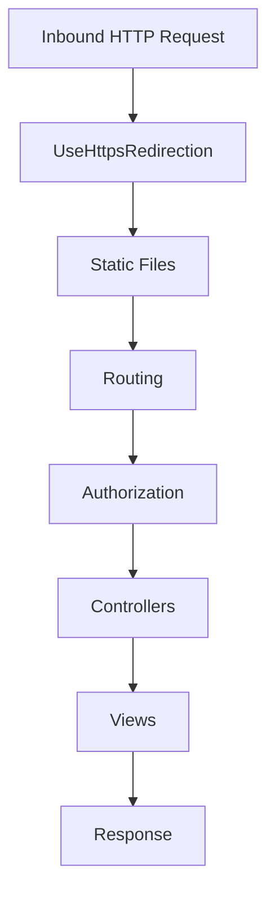

# 🏗 Architecture Overview

## High-Level

Demo1 is an ASP.NET Core MVC application targeting **.NET 9**. It uses the default MVC pattern:

- **Controllers**: Handle HTTP requests and orchestrate responses
- **Views**: Razor templates for HTML rendering
- **Models**: View models and domain models (currently just `ErrorViewModel`)
- **Program.cs**: Bootstraps the web host and configures middleware

## Request Pipeline



> Note: Authentication/Authorization middleware is scaffold-ready; enable and configure as needed.

## Folder Layout

```text
Controllers/        MVC controllers
Models/             View/Domain models
Views/              Razor views
wwwroot/            Static assets (css, js, images)
Properties/         launchSettings.json
appsettings*.json   Configuration files
```

## Dependencies

- **Microsoft.NET.Sdk.Web** (ASP.NET Core MVC)
- **Logging** via `ILogger<T>` (configured by default)

## Extensibility Points

- **Services** in `Program.cs`: `builder.Services.AddControllersWithViews()`
- **Middleware**: Add via `app.Use...` in `Program.cs`
- **Dependency Injection**: Register services in `Program.cs` `builder.Services`

## CI/CD & Quality

- **GitHub Actions**: `.github/workflows/dotnet.yml` for build/test
- **Copilot Agents**: `.github/workflows/copilot-agents.yml` for code review, security, documentation checks
- **Documentation Helper**: Ensures new `public` APIs include XML docs
