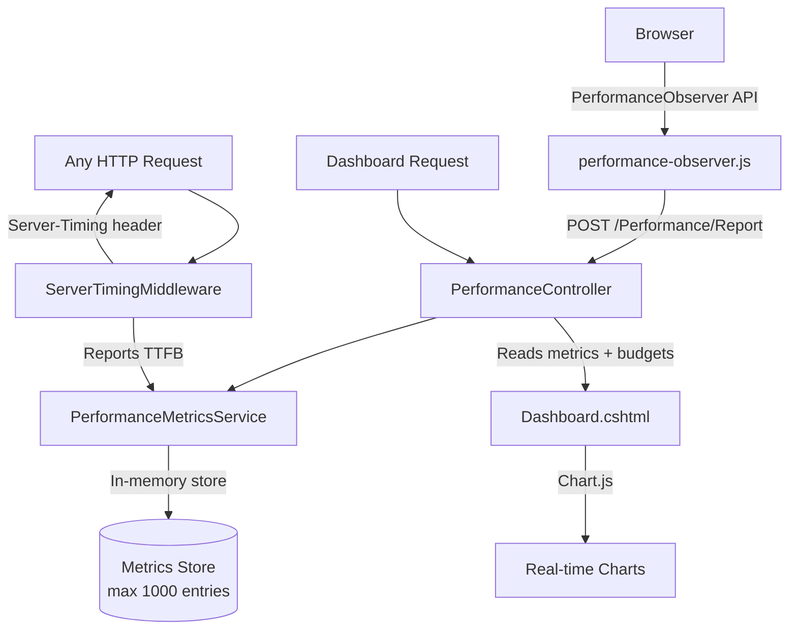

# Performance Budget Monitor

Track and visualize Core Web Vitals with configurable budget thresholds to keep your application fast.

## Table of Contents

- [Overview](#overview)
- [Architecture](#architecture)
- [API Endpoints](#api-endpoints)
- [Configuration](#configuration)
- [Budget Thresholds](#budget-thresholds)
- [Server-Timing Middleware](#server-timing-middleware)
- [Client-Side Collection](#client-side-collection)
- [Dashboard](#dashboard)

---

## Overview

The Performance Budget Monitor tracks Core Web Vitals metrics in real time and compares them against configurable budget thresholds. It provides immediate visual feedback when metrics exceed acceptable limits.

**Tracked Metrics:**

| Metric | Full Name | What It Measures |
|--------|-----------|-----------------|
| **LCP** | Largest Contentful Paint | Loading performance — time until the largest visible element renders |
| **CLS** | Cumulative Layout Shift | Visual stability — unexpected layout movement during page load |
| **TTFB** | Time to First Byte | Server responsiveness — time from request to first byte of response |
| **FID** | First Input Delay | Interactivity — delay between user interaction and browser response |

The system collects metrics from the browser via the PerformanceObserver API, stores them in memory (capped at 1,000 entries), and renders a real-time dashboard with Chart.js visualizations and traffic-light status indicators.

---

## Architecture



### Components

| Component | Path | Responsibility |
|-----------|------|----------------|
| Controller | `Controllers/PerformanceController.cs` | Dashboard view and API endpoints for reporting/querying metrics |
| Service | `Services/PerformanceMetricsService.cs` | In-memory metrics store implementing `IPerformanceMetricsService`; caps storage at 1,000 entries |
| Middleware | `Middleware/ServerTimingMiddleware.cs` | Measures TTFB and adds `Server-Timing` header to every response |
| Budget Model | `Models/PerformanceBudget.cs` | Budget threshold configuration (warning and error levels per metric) |
| Metric Model | `Models/PerformanceMetric.cs` | Individual metric measurement (name, value, unit, page URL, timestamp) |
| Dashboard View | `Views/Performance/Dashboard.cshtml` | Real-time dashboard rendered with Chart.js |
| Client Script | `wwwroot/js/performance-observer.js` | Browser-side Web Vitals collection and reporting |

### Service Interface

`IPerformanceMetricsService` defines the contract for the metrics store:

- **Record** a new metric measurement
- **Query** metric history by name and time range
- **Retrieve** the latest value for each metric (for dashboard status cards)

The default implementation holds metrics in a thread-safe, in-memory collection. When the collection exceeds 1,000 entries, the oldest measurements are evicted.

---

## API Endpoints

### `GET /Performance/Dashboard`

Renders the performance dashboard view with current metrics, budget status, and historical charts.

**Response:** HTML view (`Views/Performance/Dashboard.cshtml`)

---

### `POST /Performance/Report`

Reports a single metric measurement from the client.

**Request Body:**

```json
{
  "metricName": "LCP",
  "value": 1850.5,
  "unit": "ms",
  "pageUrl": "/Home/Index",
  "timestamp": "2024-01-15T10:30:00Z"
}
```

| Field | Type | Description |
|-------|------|-------------|
| `metricName` | string | Metric identifier (`LCP`, `CLS`, `TTFB`, `FID`) |
| `value` | number | Measured value |
| `unit` | string | Unit of measurement (`ms` or empty string for unitless) |
| `pageUrl` | string | Page where the metric was captured |
| `timestamp` | string (ISO 8601) | When the measurement occurred |

**Response:** `200 OK` on success

---

### `GET /Performance/History`

Returns historical metric data for charting.

**Query Parameters:**

| Parameter | Type | Default | Description |
|-----------|------|---------|-------------|
| `metricName` | string | *(required)* | Metric to query (`LCP`, `CLS`, `TTFB`, `FID`) |
| `minutes` | int | `60` | Time window in minutes to look back |

**Example Request:**

```
GET /Performance/History?metricName=LCP&minutes=60
```

**Response:** JSON array of metric measurements within the specified time window.

---

## Configuration

Budget thresholds are defined in `appsettings.json` under the `PerformanceBudgets` section:

```json
{
  "PerformanceBudgets": [
    { "MetricName": "LCP",  "WarningThreshold": 2500, "ErrorThreshold": 4000, "Unit": "ms" },
    { "MetricName": "TTFB", "WarningThreshold": 800,  "ErrorThreshold": 1800, "Unit": "ms" },
    { "MetricName": "CLS",  "WarningThreshold": 0.1,  "ErrorThreshold": 0.25, "Unit": ""   },
    { "MetricName": "FID",  "WarningThreshold": 100,  "ErrorThreshold": 300,  "Unit": "ms" }
  ]
}
```

| Property | Type | Description |
|----------|------|-------------|
| `MetricName` | string | Identifier matching the reported metric name |
| `WarningThreshold` | double | Upper bound for "good" status |
| `ErrorThreshold` | double | Upper bound for "needs improvement" status; values above this are "poor" |
| `Unit` | string | Display unit (`ms` for milliseconds, empty for unitless values like CLS) |

These thresholds align with [Google's Core Web Vitals recommendations](https://web.dev/vitals/).

---

## Budget Thresholds

The system uses a traffic-light model to classify each metric measurement:

| Status | Condition | Meaning |
|--------|-----------|---------|
| 🟢 **Good** | `value <= WarningThreshold` | Metric is within acceptable performance budget |
| 🟡 **Warning** | `value > WarningThreshold` and `value <= ErrorThreshold` | Metric needs improvement; approaching budget limit |
| 🔴 **Error** | `value > ErrorThreshold` | Metric exceeds budget; user experience is degraded |

### Visual Indicators

- **Status cards** on the dashboard display a traffic-light color for each metric's latest value.
- **Chart annotations** draw dashed horizontal lines at each threshold:
  - Yellow dashed line at `WarningThreshold`
  - Red dashed line at `ErrorThreshold`

This provides immediate at-a-glance awareness of performance regressions.

---

## Server-Timing Middleware

`ServerTimingMiddleware` is registered in the request pipeline and automatically measures Time to First Byte for every HTTP response.

### Behavior

1. Records a high-resolution timestamp when the request enters the middleware.
2. Registers a callback on `HttpResponse.OnStarting` (fires just before headers are sent).
3. Calculates elapsed time and appends the header:

   ```
   Server-Timing: ttfb;dur=12.3
   ```

4. Reports the TTFB value to `IPerformanceMetricsService` for storage and dashboard display.

### Header Format

The `Server-Timing` header follows the [W3C Server Timing specification](https://www.w3.org/TR/server-timing/):

```
Server-Timing: ttfb;dur=<milliseconds>
```

Browser DevTools (Network tab → Timing) automatically parse and display this header, providing server-side timing visibility without additional tooling.

---

## Client-Side Collection

The script at `wwwroot/js/performance-observer.js` uses the browser's [PerformanceObserver API](https://developer.mozilla.org/en-US/docs/Web/API/PerformanceObserver) to capture Web Vitals and report them to the server.

### Collected Metrics

| Metric | Entry Type | Notes |
|--------|-----------|-------|
| LCP | `largest-contentful-paint` | Reports the final LCP candidate value |
| CLS | `layout-shift` | Accumulates shifts without recent input |
| FID | `first-input` | Measures delay on the first user interaction |

### Reporting Flow

1. The script registers `PerformanceObserver` instances for each supported entry type.
2. When a metric is captured, it constructs a payload with `metricName`, `value`, `unit`, `pageUrl`, and `timestamp`.
3. It sends a `POST` request to `/Performance/Report` using `navigator.sendBeacon` (or `fetch` as fallback) to ensure delivery even during page unload.

### Including the Script

The script is included in pages where you want to collect metrics. Add it to your layout or specific views:

```html
<script src="~/js/performance-observer.js" defer></script>
```

> **Note:** The script is non-blocking (`defer`) and has no external dependencies.

---

## Dashboard

The dashboard at `/Performance/Dashboard` provides a real-time view of application performance:

- **Status cards** — One card per metric showing the latest value with traffic-light coloring
- **Time-series charts** — Chart.js line charts with historical data points
- **Threshold annotations** — Dashed lines on charts indicating warning (yellow) and error (red) boundaries
- **Auto-refresh** — The dashboard polls `/Performance/History` at a configurable interval to update charts

### Screenshot Layout

```
┌─────────────────────────────────────────────────────┐
│  Performance Budget Monitor                         │
├────────────┬────────────┬────────────┬──────────────┤
│  🟢 LCP   │  🟡 TTFB   │  🟢 CLS   │  🟢 FID     │
│  1850 ms  │  950 ms    │  0.05      │  45 ms      │
├────────────┴────────────┴────────────┴──────────────┤
│  [LCP Chart with threshold lines]                   │
│  [TTFB Chart with threshold lines]                  │
│  [CLS Chart with threshold lines]                   │
│  [FID Chart with threshold lines]                   │
└─────────────────────────────────────────────────────┘
```

---

## Related Documentation

- [Architecture Overview](architecture.md)
- [Configuration Guide](configuration.md)
- [Health Endpoint](health-endpoint.md)
