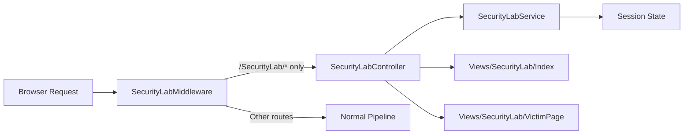

# Security Headers Playground

An interactive educational feature that demonstrates how HTTP security headers protect against common web attacks.

## Overview

The Security Headers Playground (`/SecurityLab`) provides a safe, isolated environment where users can toggle HTTP security headers on and off, then launch simulated attacks to observe how headers mitigate real-world threats. The playground is entirely session-scoped and only affects requests to `/SecurityLab/*` routes — the rest of the application remains fully protected at all times.

## How to Use

1. **Navigate** to `/SecurityLab` in the running application.
2. **Toggle headers** using the switches on the left panel. Each toggle controls one HTTP security header (e.g., `Content-Security-Policy`, `X-Frame-Options`).
3. **Launch attacks** by clicking the corresponding attack button. The right panel displays an embedded victim page and an explanation of the outcome.
4. **Observe** the Protection Score update dynamically as headers are enabled or disabled.
5. **Reset** all headers to their secure defaults using the Reset button.

## Available Attack Scenarios

| Attack | Header Mitigating | Description |
|--------|-------------------|-------------|
| **Cross-Site Scripting (XSS)** | `Content-Security-Policy` | Injects an inline `<script>` tag that changes the page background and displays an "XSS EXECUTED" message. When CSP is active, the browser blocks the inline script. |
| **Clickjacking** | `X-Frame-Options` | Renders a transparent iframe over the victim page, tricking users into clicking hidden elements. When `X-Frame-Options: DENY` is set, browsers refuse to embed the page in an iframe. |
| **MIME Type Sniffing** | `X-Content-Type-Options` | Attempts to trick the browser into interpreting a response as a different MIME type. When `nosniff` is active, browsers strictly respect the declared content-type. |

## Managed Headers

The playground manages these five headers per session:

- `Content-Security-Policy`
- `X-Frame-Options`
- `X-Content-Type-Options`
- `X-XSS-Protection`
- `Referrer-Policy`

## Architecture

### Component Responsibilities

| Component | Responsibility |
|-----------|---------------|
| `SecurityLabMiddleware` | Intercepts responses for `/SecurityLab/*` routes and conditionally removes security headers based on session state. |
| `SecurityLabController` | Handles HTTP requests: renders the playground UI, processes header toggle AJAX calls, serves attack info, and renders the victim page. |
| `SecurityLabService` | Manages per-session header states, provides attack scenario definitions, and calculates the protection score. |
| `ISecurityLabService` | Interface contract for the service, enabling dependency injection and testability. |
| `SecurityLabViewModel` | Carries header states, attack scenarios, and protection score to the view. |
| `AttackScenario` / `AttackType` | Models representing each attack demonstration and its metadata. |

## Security Considerations

- **Route isolation**: The middleware activates **only** for paths starting with `/SecurityLab`. All other application routes continue to receive the full set of security headers regardless of lab state.
- **Session-scoped**: Header configuration is stored in the user's session, so one user's experimentation does not affect others.
- **No real vulnerabilities**: The attacks are simulated demonstrations. The XSS payload only modifies the lab's own victim page; clickjacking uses the lab's own iframe target.
- **Anti-forgery relaxation**: The `Configure` and `Reset` endpoints use `[IgnoreAntiforgeryToken]` because they accept JSON from client-side `fetch()` calls. This is acceptable here because the endpoints only modify transient session state within the lab.

## Related Files

- `Controllers/SecurityLabController.cs`
- `Middleware/SecurityLabMiddleware.cs`
- `Services/ISecurityLabService.cs`
- `Services/SecurityLabService.cs`
- `Models/AttackScenario.cs`
- `Models/SecurityLabViewModel.cs`
- `Views/SecurityLab/Index.cshtml`
- `Views/SecurityLab/VictimPage.cshtml`
